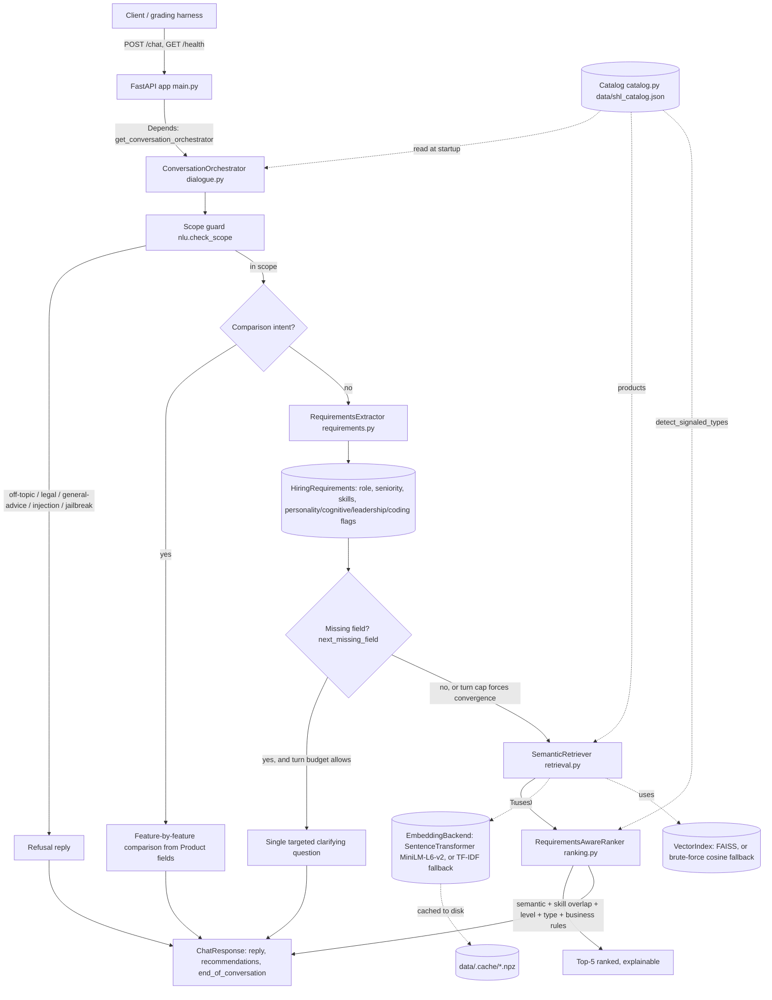

# Architecture

## System diagram



*(GitHub, GitLab, and most Markdown viewers render the block above as a
diagram. If your viewer doesn't support Mermaid, the ASCII version below
carries the same information.)*

```
Client ──POST /chat──▶ FastAPI (main.py)
                          │  Depends(get_conversation_orchestrator)
                          ▼
                 ConversationOrchestrator (dialogue.py)
                          │
        ┌─────────────────┼───────────────────────────┐
        ▼                 ▼                           ▼
  Scope guard      Comparison intent?          Requirements turn
  (nlu.py)         (nlu.py + catalog           (requirements.py)
        │           .find_by_name_fragment)           │
        │                 │                           ▼
   refuse if flagged   feature table from      HiringRequirements
                       Product fields                 │
                                                        ▼
                                          next_missing_field()?
                                          ── yes ──▶ ask ONE question
                                          ── no  ──▶ retrieve + rank
                                                        │
                                       SemanticRetriever (retrieval.py)
                                       Top-20 candidates
                                                        │
                                       RequirementsAwareRanker (ranking.py)
                                       semantic + skill + level + type + rules
                                       Top-5, explainable
                                                        │
                                                        ▼
                                        ChatResponse (unchanged schema)

Catalog (catalog.py) is read once at startup and is the only source of
truth every recommendation is drawn from.
```

## Component responsibilities (Single Responsibility Principle)

| Module | Owns | Does not own |
|---|---|---|
| `catalog.py` | Loading/validating catalog data, `Product` records, keyword fallback search | Retrieval ranking, conversation logic |
| `requirements.py` | Parsing conversation text into `HiringRequirements` | Deciding what to do with those requirements |
| `retrieval.py` | Embedding backends, vector indexes, Top-20 semantic candidates, embedding cache | Business-rule scoring, conversation flow |
| `ranking.py` | Combining semantic score + skill overlap + level + type + business rules into an explainable Top-5 | Retrieval itself, conversation flow |
| `nlu.py` | Scope guard (safety), comparison/closing/refinement text detection | Requirements extraction, ranking |
| `dialogue.py` | Orchestrating the above into one stateless turn | Any of the above's internal logic |
| `main.py` | HTTP wiring, schema, DI, lifespan, error boundary | Business logic |
| `exceptions.py` | Typed error hierarchy | — |
| `logging_config.py` | One-time logging setup | — |

## Why these boundaries

- **`Catalog` has zero knowledge of retrieval or ranking.** It can be
  swapped for a database-backed implementation later without touching
  `retrieval.py` or `ranking.py`, because both depend only on
  `list[Product]`.
- **`SemanticRetriever` depends on `Protocol`s, not concrete libraries.**
  `EmbeddingBackend` and `VectorIndex` are structural types; the
  SentenceTransformer+FAISS implementation and the TF-IDF+brute-force
  fallback both satisfy the same two methods (`encode` / `build`+`search`).
  This is what makes the "graceful degradation" behavior a design property
  instead of a special case bolted on.
- **`RequirementsAwareRanker` never touches raw conversation text.** It only
  ever sees a `HiringRequirements` object and a list of `(Product, score)`
  tuples. This is what makes it unit-testable without any NLP at all (see
  `tests/test_ranking.py`) and is why the ranking weights can be tuned
  independently of how text gets turned into requirements.
- **`ConversationOrchestrator` is the only class that knows the *order* of
  operations** (scope → comparison → clarify → retrieve/rank). Everything
  it calls is a pure function of its inputs, which is what let
  `tests/test_requirements.py`, `tests/test_retrieval.py`, and
  `tests/test_ranking.py` each test one layer without spinning up FastAPI.

## Retrieval backends: primary vs. fallback

| | Primary (Priority 1 spec) | Fallback (used automatically if primary can't load) |
|---|---|---|
| Embeddings | `sentence-transformers` `all-MiniLM-L6-v2` | scikit-learn `TfidfVectorizer` |
| Index | `faiss.IndexFlatIP` (cosine via inner product on normalized vectors) | Brute-force cosine (`numpy` matmul) |
| Trigger to fall back | Import failure, or model weights can't be downloaded (no network egress) | — |
| Where decided | `retrieval.build_default_retriever()` — the single factory function that is the entire blast radius of this decision | — |

This fallback is why every retrieval/ranking test in this repo can run
without network access or GPU/model weights: `tests/test_retrieval.py` and
`tests/test_ranking.py` construct the fallback backend directly and assert
against it, while `build_default_retriever()` is the only place that
prefers the real stack when available.

## Request lifecycle (one `/chat` call)

1. **Lifespan startup** (once per process): `get_orchestrator()` builds the
   `Catalog`, then `build_default_retriever()` builds embeddings (cached to
   `data/.cache/*.npz` after the first run) and the vector index.
2. **Scope guard**: regex-based checks for jailbreak, prompt injection,
   legal advice, general hiring advice, and off-topic content run first,
   before any other logic touches the message.
3. **Comparison check**: if the message matches a comparison pattern
   ("X vs Y", "difference between X and Y"), both names are resolved
   against the catalog and a feature-by-feature table is returned —
   independent of the clarify/recommend/refine path below.
4. **Requirements extraction**: the *entire* user-turn transcript (not just
   the latest message) is re-parsed into a `HiringRequirements` object
   every call, since the API is stateless.
5. **Clarify-or-commit decision**: `next_missing_field()` looks at what's
   still missing (role → focus → seniority, in that priority order) and
   either asks one targeted question or proceeds — with a hard override to
   always proceed once 3 user turns have passed, so the 8-turn cap can
   never be exceeded by an open clarification loop.
6. **Retrieve + rank**: the structured requirements render to a query
   string, semantic retrieval returns its Top-20, and the ranker combines
   semantic similarity with skill overlap / level match / type match /
   business rules (add/remove signals parsed clause-by-clause from the
   latest message) into a Top-5 (capped at 10 by the API contract).
7. **Response**: serialized to the unchanged `ChatResponse` schema.
